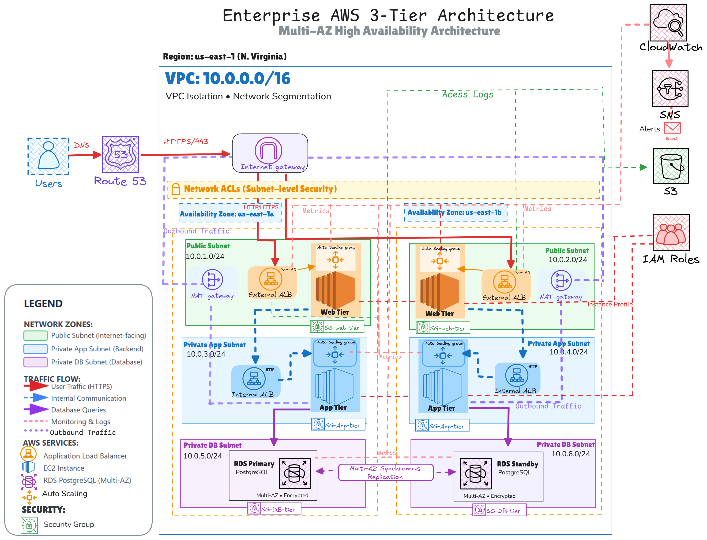
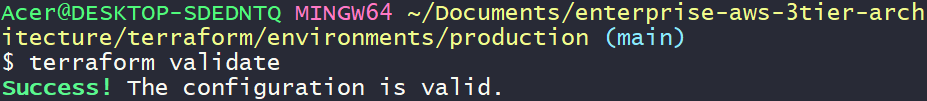
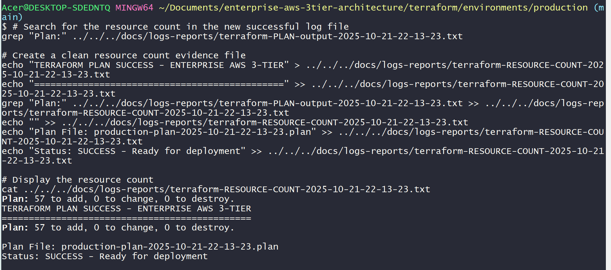
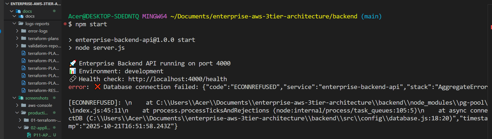
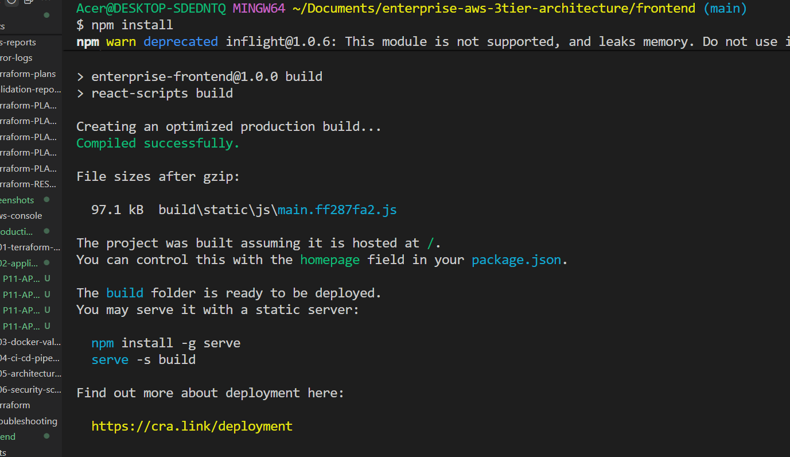
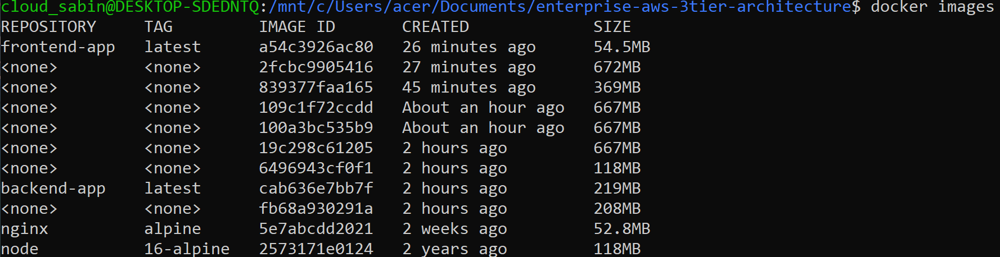
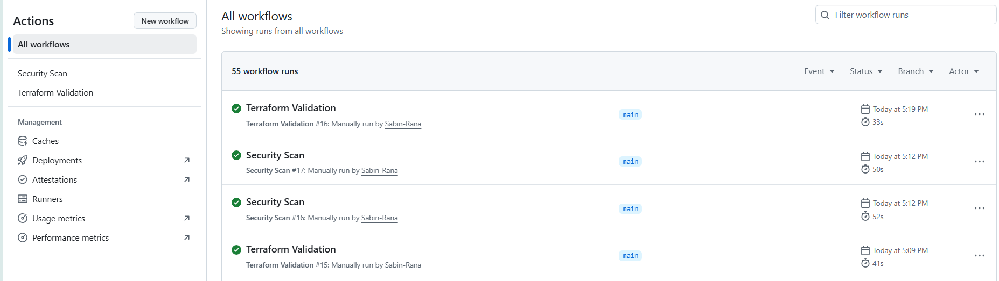
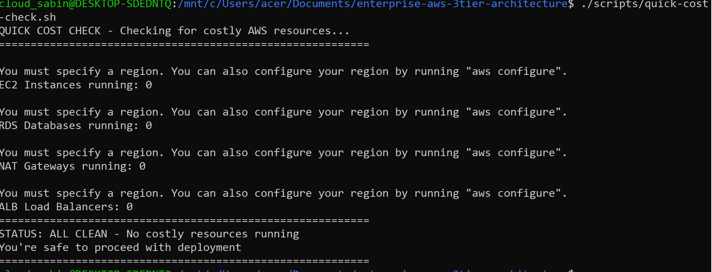

# ENTERPRISE AWS 3-TIER ARCHITECTURE

[](https://opensource.org/licenses/MIT)
[](https://github.com/Sabin-Rana/enterprise-aws-3tier-architecture)
[](https://www.terraform.io/)
[](https://aws.amazon.com/)
[]()
[]()
[]()
---

## Contents

- [Project Metrics](#project-metrics)
- [Architecture Diagram](#architecture-diagram)
- [Project Highlights](#project-highlights)
- [The Story Behind This Architecture](#the-story-behind-this-architecture)
- [Architecture Overview](#architecture-overview)
- [Safety Implementation](#safety-implementation)
- [Technical Stack](#technical-stack)
- [Getting Started](#getting-started)
- [Project Structure](#project-structure)
- [Professional Value](#professional-value)

---

## Project Metrics

| Metric | Value |
|--------|-------|
| AWS Resources | 57 |
| Terraform Modules | 6 |
| Safety Scripts | 7 |
| CI/CD Workflows | 5 |
| Validation Cycles | 5+ |
| Development Cost | $0 |

---

## Architecture Diagram



*Complete 57-resource AWS infrastructure with safety-first validation approach*

---

## Project Highlights

[](https://www.credly.com/badges/080be029-2747-438f-82cc-5f403008e2fa)

A comprehensive enterprise-grade cloud infrastructure blueprint, professionally engineered and validated through a strategic zero-cost methodology. This project demonstrates a complete DevOps pipeline infrastructure, with all infrastructure and application code tested and ready for secure, controlled deployment.

### Key Achievements

- 57 AWS Resources designed and validated
- 6 Terraform Modules with enterprise-grade configuration
- Zero-Cost Validation via comprehensive Terraform planning
- Safety-First CI/CD with manual trigger controls
- Full-Stack Applications with Node.js and React
- 7 Safety Scripts for cost management and emergency protocols
- Deployment-Ready State awaiting controlled `terraform apply`

### Validation Evidence

<div align="center">

<div style="height: 400px; display: flex; align-items: center; justify-content: center; border: 1px solid #d0d7de; border-radius: 8px; padding: 20px; background: linear-gradient(135deg, #667eea 0%, #764ba2 100%); box-shadow: 0 4px 6px rgba(0,0,0,0.1); margin: 20px 0;">
  
</div>
<div style="background: #f8f9fa; padding: 15px; border-radius: 8px; margin: 10px 0 30px 0; border-left: 4px solid #28a745;">
  <h4 style="margin: 0 0 8px 0; color: #2c3e50;"> Terraform Configuration Validated</h4>
  <p style="margin: 0; color: #6c757d;">Successfully validated across all 6 modules with zero syntax errors</p>
</div>

<div style="height: 400px; display: flex; align-items: center; justify-content: center; border: 1px solid #d0d7de; border-radius: 8px; padding: 20px; background: linear-gradient(135deg, #667eea 0%, #764ba2 100%); box-shadow: 0 4px 6px rgba(0,0,0,0.1); margin: 20px 0;">
  
</div>
<div style="background: #f8f9fa; padding: 15px; border-radius: 8px; margin: 10px 0 30px 0; border-left: 4px solid #007bff;">
  <h4 style="margin: 0 0 8px 0; color: #2c3e50;">Infrastructure Planning Complete</h4>
  <p style="margin: 0; color: #6c757d;">57 AWS resources planned and validated without deployment costs</p>
</div>

<div style="height: 400px; display: flex; align-items: center; justify-content: center; border: 1px solid #d0d7de; border-radius: 8px; padding: 20px; background: linear-gradient(135deg, #667eea 0%, #764ba2 100%); box-shadow: 0 4px 6px rgba(0,0,0,0.1); margin: 20px 0;">
  
</div>
<div style="background: #f8f9fa; padding: 15px; border-radius: 8px; margin: 10px 0 30px 0; border-left: 4px solid #6f42c1;">
  <h4 style="margin: 0 0 8px 0; color: #2c3e50;"> Backend Application Ready</h4>
  <p style="margin: 0; color: #6c757d;">Node.js API server running with comprehensive error handling</p>
</div>

<div style="height: 400px; display: flex; align-items: center; justify-content: center; border: 1px solid #d0d7de; border-radius: 8px; padding: 20px; background: linear-gradient(135deg, #667eea 0%, #764ba2 100%); box-shadow: 0 4px 6px rgba(0,0,0,0.1); margin: 20px 0;">
  
</div>
<div style="background: #f8f9fa; padding: 15px; border-radius: 8px; margin: 10px 0 30px 0; border-left: 4px solid #e83e8c;">
  <h4 style="margin: 0 0 8px 0; color: #2c3e50;"> Frontend Build Successful</h4>
  <p style="margin: 0; color: #6c757d;">React application built with modern tooling and testing</p>
</div>

<div style="height: 400px; display: flex; align-items: center; justify-content: center; border: 1px solid #d0d7de; border-radius: 8px; padding: 20px; background: linear-gradient(135deg, #667eea 0%, #764ba2 100%); box-shadow: 0 4px 6px rgba(0,0,0,0.1); margin: 20px 0;">
  
</div>
<div style="background: #f8f9fa; padding: 15px; border-radius: 8px; margin: 10px 0 30px 0; border-left: 4px solid #20c997;">
  <h4 style="margin: 0 0 8px 0; color: #2c3e50;">🐳 Docker Images Created</h4>
  <p style="margin: 0; color: #6c757d;">Frontend and backend containers built and verified for enterprise deployment</p>
</div>

<div style="height: 400px; display: flex; align-items: center; justify-content: center; border: 1px solid #d0d7de; border-radius: 8px; padding: 20px; background: linear-gradient(135deg, #667eea 0%, #764ba2 100%); box-shadow: 0 4px 6px rgba(0,0,0,0.1); margin: 20px 0;">
  
</div>
<div style="background: #f8f9fa; padding: 15px; border-radius: 8px; margin: 10px 0 30px 0; border-left: 4px solid #fd7e14;">
  <h4 style="margin: 0 0 8px 0; color: #2c3e50;"> CI/CD Pipeline Validated</h4>
  <p style="margin: 0; color: #6c757d;">Safe validation workflows executing successfully with manual triggers</p>
</div>

<div style="height: 400px; display: flex; align-items: center; justify-content: center; border: 1px solid #d0d7de; border-radius: 8px; padding: 20px; background: linear-gradient(135deg, #667eea 0%, #764ba2 100%); box-shadow: 0 4px 6px rgba(0,0,0,0.1); margin: 20px 0;">
  
</div>
<div style="background: #f8f9fa; padding: 15px; border-radius: 8px; margin: 10px 0 30px 0; border-left: 4px solid #dc3545;">
  <h4 style="margin: 0 0 8px 0; color: #2c3e50;">Zero-Cost Validation Confirmed</h4>
  <p style="margin: 0; color: #6c757d;">Comprehensive cost audit verifying zero AWS resources and billing compliance</p>
</div>

</div>

## The Story Behind This Architecture

### From $10 Scare to Zero-Cost Mastery

This project represents a fundamental shift in cloud engineering mindset, born from a critical lesson in cost management that transformed my approach to infrastructure design.

**[Read the Full Journey: "From $10 Scare to Zero-Cost Mastery"](https://sabin-codeops.hashnode.dev/from-10-scare-to-zero-cost-mastery-my-aws-3-tier-architecture-journey)**

### The Learning Foundation

**[Terraform Automation Journey](https://github.com/Sabin-Rana/terraform-learning-journey)** - Structured learning path with comprehensive hands-on labs

**[Manual AWS 3-Tier Implementation](https://github.com/Sabin-Rana/aws-3tier-architecture)** - Foundational architecture built through AWS console (115 documented steps)

**Enterprise Automation** - This project: 57 resources across 6 Terraform modules

### Evolution Path

Manual Console Operations → Infrastructure as Code Foundation → Enterprise-Grade Automation

### Key Insights

Financial responsibility in cloud engineering. Treating every dollar as critical infrastructure cost.

Progressive skill development. Building from manual operations to automated enterprise solutions.

Deep understanding before automation. Mastering AWS services manually before implementing Infrastructure as Code.

Safety-first infrastructure. 7 automation scripts for cost control and emergency protocols.

Real-world problem solving. 62+ documented challenges and solutions from hands-on experience.

---

## Architecture Overview

### Networking Foundation (VPC Module)

VPC (10.0.0.0/16) with DNS support and multi-AZ deployment across us-east-1. Internet Gateway for public subnet access. NAT Gateways with Elastic IPs for private subnet outbound traffic.

**Subnets:**
- Public Subnets: 10.0.1.0/24, 10.0.2.0/24 (web tier)
- Private App Subnets: 10.0.3.0/24, 10.0.4.0/24 (application tier)
- Private DB Subnets: 10.0.5.0/24, 10.0.6.0/24 (database tier)

Route tables and associations configured for proper traffic routing between availability zones.

### Security Layer (Security Module)

Security groups with dynamic ingress and egress rules. Network segmentation between public and private subnets.

**Security Groups:**
- Web Tier: Ports 80/443 for HTTP/HTTPS traffic
- App Tier: Port 4000 for application traffic
- DB Tier: Port 5432 for PostgreSQL database

IAM roles and policies for EC2 Systems Manager access with least-privilege principles.

### Compute Layer (Compute Module)

EC2 Launch Templates with Amazon Linux 2 AMI and t2.micro instances. Auto Scaling Groups for web and application tiers with health monitoring and load balancer integration.

**Auto Scaling Configuration:**
- Web Tier ASG: Minimum 2, Maximum 4 instances
- App Tier ASG: Minimum 2, Maximum 4 instances

Scaling policies based on CPU utilization with CloudWatch alarm integration.

### Load Balancing (Load Balancing Module)

Application Load Balancer with HTTP listeners on port 80. Target groups with health checks on /health endpoint. Cross-zone load balancing enabled for high availability.

Health check configuration with 30-second intervals and traffic distribution across multiple availability zones.

### Database Layer (Database Module)

RDS PostgreSQL 14.9 with multi-AZ deployment for high availability. DB subnet group for isolated database network placement. Encrypted storage with automated backups and 7-day retention.

Performance Insights enabled for database monitoring. Parameter groups and maintenance windows configured for enterprise standards.

### Monitoring and Observability (Monitoring Module)

CloudWatch Dashboard with 4 comprehensive widgets tracking EC2 CPU utilization, ALB health and request metrics, RDS performance metrics, and Auto Scaling Group instances.

**CloudWatch Alarms:**
- High CPU utilization (Web/App tiers over 80%)
- Database performance issues (over 75% CPU)
- ALB 5XX errors (over 10 errors threshold)

SNS topics configured for alert notifications to operations team.

---

## Safety Implementation

### CI/CD Pipeline Strategy

**Active Workflows (Safe Validation):**
- Terraform Validation: Syntax checking, configuration validation, planning only
- Security Scanning: npm audit, Gitleaks, code quality with continue-on-error

**Disabled Workflows (Safety Measure):**
- Backend Deployment: EC2 deployment and application installation
- Frontend Deployment: S3 sync and CloudFront invalidation
- Terraform Apply: AWS resource creation and state modification

### 7 Safety and Automation Scripts

**comprehensive-cost-check.sh** - Detailed AWS cost auditing with resource enumeration

**cost-checker.sh** - Quick cost assessment and running resource identification

**emergency-nuke-all.sh** - Complete infrastructure termination for emergency situations

**pre-deploy-check.sh** - Pre-deployment validation and safety verification

**post-deploy-check.sh** - Post-deployment verification and health checks

**quick-cost-check.sh** - Rapid cost estimation and budget compliance

**safety-destroy.sh** - Safe infrastructure teardown with confirmation prompts

### Zero-Cost Validation Approach

Terraform planning only. No terraform apply commands executed during development.

Backend and frontend validation through build and test processes without EC2 or S3 deployment.

Safety protocols with manual triggers and disabled automatic deployments.

Cost guarantee: Zero AWS resources created, only configuration validation performed.

### Validation Evidence

[View Complete Log Reports on GitHub](https://github.com/Sabin-Rana/enterprise-aws-3tier-architecture/tree/main/docs/logs-reports)

5 complete Terraform plans showing full validation cycles. Resource count tracking confirming all AWS resources planned. Error resolution logs documenting troubleshooting process. Application logs showing backend and frontend validation. Cost audit reports verifying zero-cost compliance.

---

## Technical Stack

### Infrastructure and DevOps

**Terraform** - Infrastructure as Code managing 57 AWS resources across 6 modules

**GitHub Actions** - CI/CD pipeline with safety controls and manual triggers

**Docker** - Containerization for frontend and backend applications

**AWS CLI** - Cloud management and automation scripting

### AWS Services

**Compute:** EC2, Auto Scaling Groups, Launch Templates

**Networking:** VPC, Internet Gateway, NAT Gateway, Route Tables, Subnets

**Database:** RDS PostgreSQL, DB Subnet Groups

**Load Balancing:** Application Load Balancer, Target Groups, Listeners

**Security:** Security Groups, IAM Roles, IAM Policies, Network ACLs

**Monitoring:** CloudWatch Dashboards, CloudWatch Alarms, SNS Topics

**Storage:** EBS (via RDS), S3 (configured for frontend deployment)

### Application Stack

**Backend:** Node.js, Express, JWT authentication, PostgreSQL, Jest testing

**Frontend:** React, modern JavaScript, CSS, Testing Library

**Process Management:** PM2 for enterprise process management

**Web Server:** nginx for frontend serving and reverse proxy

---

## Getting Started

### Safe Validation Execution

All validation can be executed without AWS costs.

```bash
# Run comprehensive safety checks
./scripts/pre-deploy-check.sh

# Validate Terraform configuration
cd terraform/environments/production
terraform init -backend=false
terraform validate
terraform plan

# Execute application validation
cd backend
npm install
npm test
npm start

# Build and test frontend
cd frontend
npm install
npm run build
npm test
```

### Cost Safety Verification

```bash
# Comprehensive cost audit
./scripts/comprehensive-cost-check.sh

# Quick cost verification
./scripts/quick-cost-check.sh

# Emergency termination (if needed)
./scripts/emergency-nuke-all.sh
```

---

## Project Structure

```
enterprise-aws-3tier-architecture/
├── .github/workflows/              # CI/CD Pipeline
│   ├── terraform-validation.yml   # Active validation workflow
│   ├── security-scan.yml          # Active security checks
│   └── disabled/                  # Disabled deployment workflows
├── backend/                        # Node.js API
│   ├── src/                       # Application source
│   ├── tests/                     # Test suites
│   └── ecosystem.config.js        # PM2 configuration
├── frontend/                       # React Application
│   ├── src/                       # React components
│   ├── build/                     # Enterprise build
│   └── Dockerfile                 # Container configuration
├── terraform/                      # Infrastructure as Code
│   ├── modules/                   # 6 Terraform modules
│   │   ├── vpc/                  # Networking foundation
│   │   ├── security/             # Security groups and IAM
│   │   ├── database/             # RDS PostgreSQL
│   │   ├── compute/              # EC2 and Auto Scaling
│   │   ├── load_balancing/       # ALB and Target Groups
│   │   └── monitoring/           # CloudWatch and SNS
│   └── environments/production/  # Enterprise configuration
├── scripts/                        # Safety and Automation
│   ├── comprehensive-cost-check.sh
│   ├── cost-checker.sh
│   ├── emergency-nuke-all.sh
│   ├── pre-deploy-check.sh
│   ├── post-deploy-check.sh
│   ├── quick-cost-check.sh
│   └── safety-destroy.sh
├── docs/                          # Documentation
│   ├── architecture-diagram/
│   ├── screenshots-organized/
│   └── logs-reports/
└── README.md
```

---

## Professional Value

This project demonstrates enterprise-level skills in:

**Cloud Architecture Design** - Complete 3-tier AWS infrastructure with multi-AZ high availability

**Infrastructure as Code** - 57-resource Terraform configuration with modular design

**DevOps and CI/CD** - Pipeline design with safety controls and validation workflows

**Cost Optimization** - Zero-cost validation methodology proving financial responsibility

**Security Implementation** - Network segmentation, IAM policies, and defense-in-depth

**Monitoring and Observability** - CloudWatch dashboards, alarms, and automated alerting

**Problem Solving** - 62+ documented troubleshooting scenarios with solutions

**Full-Stack Development** - React frontend and Node.js backend with comprehensive testing

**Containerization** - Docker implementation for production deployment readiness

**Documentation** - Professional-grade project documentation and architecture diagrams

---

## Troubleshooting Journey

[View Complete Troubleshooting Documentation](https://github.com/Sabin-Rana/enterprise-aws-3tier-architecture/tree/main/docs/screenshots-organized/troubleshooting-journey)

Seven phases of real engineering challenges documented with screenshots and solutions:

**Phase 1:** VPC networking challenges and availability zone configuration

**Phase 2:** Security group conflicts and module dependency resolution

**Phase 3:** Database configuration and RDS parameter optimization

**Phase 4:** Infrastructure integration and module output coordination

**Phase 5:** Terraform validation and syntax correction

**Phase 6:** IAM role configuration and permission troubleshooting

**Phase 7:** CI/CD pipeline recovery and workflow optimization

Over 62 documented challenges showing real problems and real solutions from hands-on experience.

---

## License

This project is licensed under the MIT License - see the [LICENSE](LICENSE) file for details.

Free to use, modify, and distribute. Commercial use permitted. Attribution required.

---

## Author and Contact

**Sabin Rana**

GitHub: [@Sabin-Rana](https://github.com/Sabin-Rana)

LinkedIn: [Sabin Rana](https://www.linkedin.com/in/sabin-rana-377729153/)

Blog: [Hashnode](https://sabin-codeops.hashnode.dev/)

Certifications: [Credly Profile](https://www.credly.com/users/sabin-rana/badges)

---

## ⭐ Star This Repository

If you find this project helpful or impressive, please consider giving it a star on GitHub. It helps others discover this resource and supports continued work in creating professional cloud engineering content.

[Star this project on GitHub](https://github.com/Sabin-Rana/enterprise-aws-3tier-architecture)
