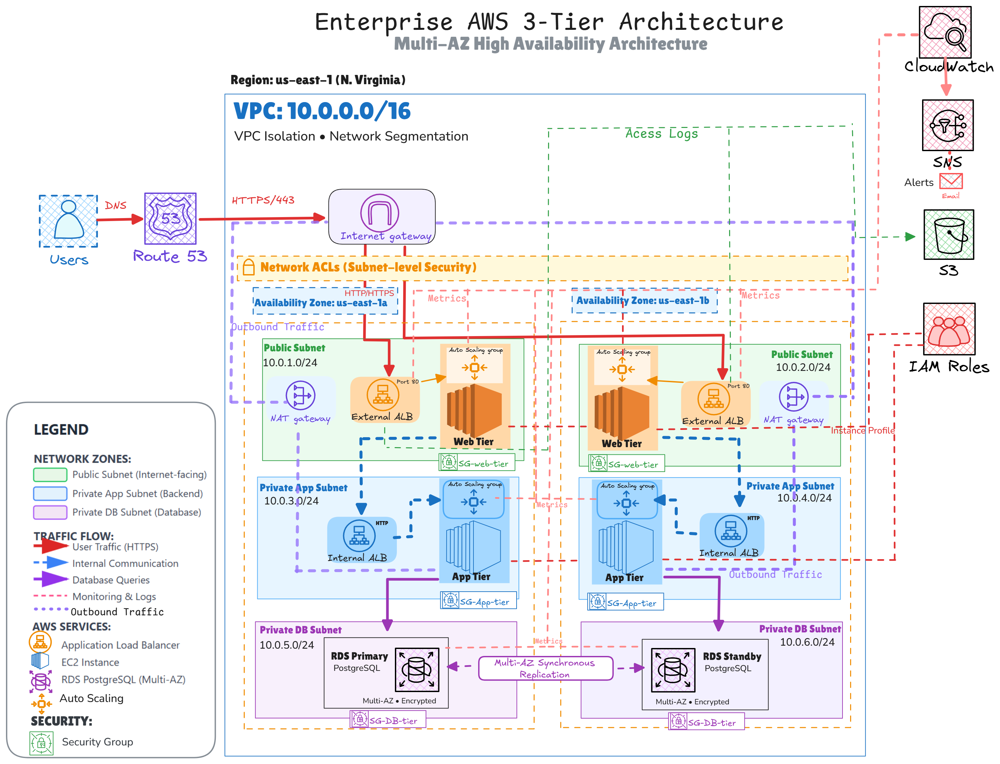
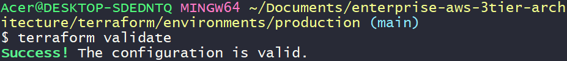
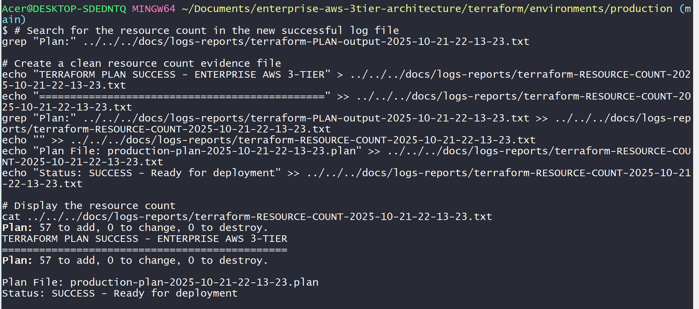

# ENTERPRISE AWS 3-TIER ARCHITECTURE - COMPLETE DOCUMENTATION

[](https://opensource.org/licenses/MIT)
[](https://github.com/Sabin-Rana/enterprise-aws-3tier-architecture)
[](https://www.terraform.io/)
[](https://aws.amazon.com/)
[]()
[]()
[]()

## Contents
- [Project Highlights](#project-highlights)
- [Architecture Overview](#architecture-overview)
- [Safety Implementation](#safety-implementation)
- [Technical Stack](#technical-stack)
- [Business Value](#business-value)
- [Getting Started](#getting-started)
- [Troubleshooting](#troubleshooting-journey)

## Project Metrics
| Metric | Value |
|--------|-------|
| AWS Resources | 57 |
| Terraform Modules | 6 |
| Safety Scripts | 7 |
| CI/CD Workflows | 5 |
| Validation Cycles | 5+ |
| Cost Impact | $0 |

## Architecture Diagram


*Complete 57-resource AWS infrastructure with safety-first validation approach*

---

## Project Highlights

<div align="center" style="margin: 20px 0; border: 1px solid #e1e4e8; border-radius: 6px; padding: 15px; background: #f6f8fa;">
  
  <br>
  <em style="color: #656d76; font-size: 14px;">Terraform configuration successfully validated across all 6 modules</em>
</div>

<div align="center" style="margin: 20px 0; border: 1px solid #e1e4e8; border-radius: 6px; padding: 15px; background: #f6f8fa;">
  
  <br>
  <em style="color: #656d76; font-size: 14px;">57 AWS resources planned and validated without deployment costs</em>
</div>

<div align="center" style="margin: 20px 0; border: 1px solid #e1e4e8; border-radius: 6px; padding: 15px; background: #f6f8fa;">
  
  <br>
  <em style="color: #656d76; font-size: 14px;">Node.js API server running successfully with comprehensive error handling</em>
</div>

<div align="center" style="margin: 20px 0; border: 1px solid #e1e4e8; border-radius: 6px; padding: 15px; background: #f6f8fa;">
  
  <br>
  <em style="color: #656d76; font-size: 14px;">React application built successfully with modern tooling and testing</em>
</div>

<div align="center" style="margin: 20px 0; border: 1px solid #e1e4e8; border-radius: 6px; padding: 15px; background: #f6f8fa;">
  
  <br>
  <em style="color: #656d76; font-size: 14px;">Both frontend and backend Docker images built and verified for production</em>
</div>

<div align="center" style="margin: 20px 0; border: 1px solid #e1e4e8; border-radius: 6px; padding: 15px; background: #f6f8fa;">
  
  <br>
  <em style="color: #656d76; font-size: 14px;">Safe validation workflows executing successfully with manual trigger safety</em>
</div>

<div align="center" style="margin: 20px 0; border: 1px solid #e1e4e8; border-radius: 6px; padding: 15px; background: #f6f8fa;">
  
  <br>
  <em style="color: #656d76; font-size: 14px;">Comprehensive cost validation confirming zero AWS resources and billing compliance</em>
</div>

---

## Executive Summary

[](https://www.credly.com/badges/080be029-2747-438f-82cc-5f403008e2fa)

A comprehensive enterprise-grade cloud infrastructure project demonstrating professional DevOps practices with zero-cost validation strategy. This project designs, validates, and documents 57 AWS resources across 6 Terraform modules while maintaining absolute cost control through safety-first workflow design and comprehensive automation.

### Key Achievements

- **57 AWS Resources** designed and validated
- **6 Terraform Modules** with production-ready configuration  
- **Zero-Cost Validation** - Everything validated, nothing deployed
- **Safety-First CI/CD** - 2 active workflows, 3 disabled for safety
- **Full-Stack Applications** - Node.js + React with comprehensive testing
- **7 Safety Scripts** for cost management and emergency protocols

---

## The Story Behind This Architecture

### From $10 Scare to Zero-Cost Mastery

This project represents a fundamental shift in cloud engineering mindset, born from a critical lesson in cost management that transformed my approach to infrastructure design.

**[Read the Full Journey: "From $10 Scare to Zero-Cost Mastery: My AWS 3-Tier Architecture Journey"](https://sabin-codeops.hashnode.dev/from-10-scare-to-zero-cost-mastery-my-aws-3-tier-architecture-journey)**

#### The Learning Foundation
- **[Terraform Automation Journey](https://github.com/Sabin-Rana/terraform-learning-journey)** - Structured learning path with comprehensive hands-on labs
- **[Manual AWS 3-Tier Implementation](https://github.com/Sabin-Rana/aws-3tier-architecture)** - Foundational architecture built through AWS console
- **Enterprise Automation** - This project: 57 resources across 6 Terraform modules

#### The Evolution Path
**Manual Console Operations → Infrastructure as Code Foundation → Enterprise-Grade Automation**

#### Key Insights from the Journey
- **Financial responsibility in cloud engineering** - Treating every dollar as critical infrastructure cost
- **Progressive skill development** - Building from manual operations to automated enterprise solutions
- **Deep understanding before automation** - Mastering AWS services manually before implementing Infrastructure as Code
- **Safety-first infrastructure** - 7 automation scripts for cost control and emergency protocols
- **Comprehensive documentation** - Architecture diagrams and troubleshooting journeys that tell complete stories
- **Real-world problem solving** - 62+ documented challenges and solutions from hands-on experience

This project demonstrates that professional cloud engineering combines technical expertise with financial responsibility, creating solutions that are both powerful and cost-aware.

---

## Architecture Overview

### Networking Foundation (VPC Module)

- **VPC** (10.0.0.0/16) with DNS support and multi-AZ deployment
- **Internet Gateway** for public subnet internet access
- **NAT Gateways** with Elastic IPs for private subnet outbound traffic
- **Public Subnets** (10.0.1.0/24, 10.0.2.0/24) for web tier resources
- **Private App Subnets** (10.0.3.0/24, 10.0.4.0/24) for application tier
- **Private DB Subnets** (10.0.5.0/24, 10.0.6.0/24) for database tier
- **Route Tables** and associations for proper traffic routing

### Security Layer (Security Module)

- **Security Groups** with dynamic ingress/egress rules
- **Web Tier Security Group** - Ports 80/443 for HTTP/HTTPS traffic
- **App Tier Security Group** - Port 4000 for application traffic
- **DB Tier Security Group** - Port 5432 for PostgreSQL database
- **Network segmentation** between public and private subnets

### Compute Layer (Compute Module)

- **EC2 Launch Templates** with Amazon Linux 2 AMI and t2.micro instances
- **Auto Scaling Groups** for web and application tiers
- **Web Tier ASG** - Minimum 2, Maximum 4 instances
- **App Tier ASG** - Minimum 2, Maximum 4 instances
- **IAM Instance Profiles** for Systems Manager access
- **Health monitoring** and load balancer integration

### Load Balancing (Load Balancing Module)

- **Application Load Balancer** with HTTP listeners on port 80
- **Target Groups** with health checks on /health endpoint
- **Listeners** for traffic routing and distribution
- **Health check configuration** with 30-second intervals
- **Traffic distribution** across multiple availability zones

### Database Layer (Database Module)

- **RDS PostgreSQL** (Version 14.9) with multi-AZ deployment
- **DB Subnet Group** for isolated database network placement
- **Encrypted storage** with automated backups (7-day retention)
- **Performance Insights** enabled for database monitoring
- **Parameter groups** and maintenance window configuration

### Monitoring & Observability (Monitoring Module)

- **CloudWatch Dashboard** with 4 comprehensive widgets:
  - EC2 CPU Utilization (Web & App Tiers)
  - ALB Health & Request Metrics
  - RDS Performance Metrics
  - Auto Scaling Group Instances
- **SNS Topics** for alert notifications
- **CloudWatch Alarms** for:
  - High CPU utilization (Web/App tiers >80%)
  - Database performance issues (>75% CPU)
  - ALB 5XX errors (>10 errors threshold)

---

## Safety Implementation

### CI/CD Pipeline Strategy

#### ACTIVE WORKFLOWS (Safe Validation)

- **Terraform Validation:** Syntax checking, configuration validation, planning only
- **Security Scanning:** npm audit, Gitleaks, code quality with continue-on-error

#### DISABLED WORKFLOWS (Safety Measure)

- **Backend Deployment:** EC2 deployment and application installation
- **Frontend Deployment:** S3 sync and CloudFront invalidation
- **Terraform Apply:** AWS resource creation and state modification

### 7 Safety & Automation Scripts

- `comprehensive-cost-check.sh` - Detailed AWS cost auditing
- `cost-checker.sh` - Quick cost assessment
- `emergency-nuke-all.sh` - Complete infrastructure termination
- `pre-deploy-check.sh` - Pre-deployment validation
- `post-deploy-check.sh` - Post-deployment verification
- `quick-cost-check.sh` - Rapid cost estimation
- `safety-destroy.sh` - Safe infrastructure teardown

### Zero-Cost Validation Approach

- **Terraform Planning Only:** terraform plan executed, terraform apply disabled
- **Backend Validation:** Application builds and tests without EC2 deployment
- **Frontend Validation:** React build process without S3 sync
- **Safety Protocols:** Manual triggers, disabled automatic deployments
- **Cost Guarantee:** Zero AWS resources created, only configuration validation

---

## Validation Evidence & Log Reports

### Complete Documentation Available
All validation evidence and log reports are available in the project's documentation:

[**View Complete Log Reports on GitHub**](https://github.com/Sabin-Rana/enterprise-aws-3tier-architecture/tree/main/docs/logs-reports)

### Evidence Includes:
- **5 Complete Terraform Plans** - Full validation cycles showing 57-resource infrastructure
- **Resource Count Tracking** - Documentation confirming all AWS resources planned
- **Error Resolution Logs** - Professional handling of validation challenges
- **Application Logs** - Backend and frontend validation with error handling
- **Cost Audit Reports** - Zero-cost verification through safety scripts

### Zero-Cost Verification
All validation performed through Terraform planning only - no AWS resources created, ensuring complete cost control while demonstrating full infrastructure capability.

---

## Technical Stack

### Infrastructure & DevOps

- **Terraform** - Infrastructure as Code (57 resources)
- **GitHub Actions** - CI/CD Pipeline with safety controls
- **Docker** - Containerization for both applications
- **AWS CLI** - Cloud management and automation

### AWS Services Implemented

- **Compute:** EC2, Auto Scaling, Launch Templates
- **Networking:** VPC, Internet Gateway, NAT Gateway, Route Tables, Subnets
- **Database:** RDS PostgreSQL, DB Subnet Groups
- **Load Balancing:** Application Load Balancer, Target Groups, Listeners
- **Security:** Security Groups, IAM Roles, IAM Policies
- **Monitoring:** CloudWatch, SNS, CloudWatch Alarms, Dashboards
- **Storage:** EBS (via RDS), S3 (configured for frontend)

### Application Stack

- **Backend:** Node.js, Express, JWT, PostgreSQL, Jest
- **Frontend:** React, modern JavaScript, CSS, Testing Library
- **Process Management:** PM2 for production process management
- **Web Server:** nginx for frontend serving

---

## Business Value

**Note:** All infrastructure validated without deployment costs using Terraform planning only

**Safety:** 7 automation scripts prevent unexpected AWS charges

**Enterprise:** Production-grade patterns with zero financial risk

This project demonstrates enterprise-level skills in:

- **Cloud Architecture Design:** Complete 3-tier AWS infrastructure
- **Infrastructure as Code:** 57-resource Terraform configuration
- **DevOps & CI/CD:** Pipeline design with safety controls
- **Cost Optimization:** Zero-cost validation methodology
- **Problem-Solving:** Comprehensive troubleshooting documentation
- **Security Implementation:** Network segmentation and access controls
- **Monitoring & Observability:** CloudWatch dashboards and alerting
- **Full-Stack Development:** React frontend and Node.js backend
- **Containerization:** Docker implementation for both applications
- **Documentation:** Professional-grade project documentation

---

## Getting Started

### Safe Validation Execution

All validation can be executed without AWS costs:

```bash
# Run comprehensive safety checks
./scripts/pre-deploy-check.sh

# Validate Terraform configuration
cd terraform/environments/production
terraform init -backend=false
terraform validate
terraform plan

# Execute application validation
cd backend
npm install
npm test
npm start

# Build and test frontend
cd frontend  
npm install
npm run build
npm test
---

## Project Structure

```
enterprise-aws-3tier-architecture/
├── .github/workflows/              # CI/CD Pipeline
│   ├── terraform-validation.yml   # ACTIVE - Safe validation
│   ├── security-scan.yml          # ACTIVE - Security checks
│   └── disabled/                  # SAFETY - Deployment workflows
├── backend/                        # Node.js API
│   ├── src/                       # Application source
│   │   ├── config/               # Configuration files
│   │   ├── controllers/          # API controllers
│   │   ├── middleware/           # Authentication & validation
│   │   ├── models/               # Data models
│   │   ├── routes/               # API routes
│   │   └── utils/                # Utility functions
│   ├── tests/                     # Test suites
│   ├── logs/                      # Application logs
│   ├── .eslintrc.json            # Code quality
│   ├── jest.config.js            # Testing configuration
│   └── ecosystem.config.js       # PM2 configuration
├── frontend/                      # React Application
│   ├── src/                      # React components
│   ├── public/                   # Static assets
│   ├── build/                    # Production build
│   ├── nginx.conf                # Web server configuration
│   └── Dockerfile                # Container configuration
├── terraform/                     # Infrastructure as Code
│   ├── modules/                  # 6 Terraform modules
│   │   ├── vpc/                 # Networking foundation
│   │   │   ├── main.tf
│   │   │   ├── nat_gateways.tf
│   │   │   ├── outputs.tf
│   │   │   ├── route_tables.tf
│   │   │   └── variables.tf
│   │   ├── security/            # Security groups & IAM
│   │   │   ├── main.tf
│   │   │   ├── outputs.tf
│   │   │   └── variables.tf
│   │   ├── database/            # RDS PostgreSQL
│   │   │   ├── main.tf
│   │   │   ├── outputs.tf
│   │   │   └── variables.tf
│   │   ├── compute/             # EC2 & Auto Scaling
│   │   │   ├── main.tf
│   │   │   ├── outputs.tf
│   │   │   └── variables.tf
│   │   ├── load_balancing/      # ALB & Target Groups
│   │   │   ├── main.tf
│   │   │   ├── outputs.tf
│   │   │   └── variables.tf
│   │   └── monitoring/          # CloudWatch & SNS
│   │       ├── main.tf
│   │       ├── outputs.tf
│   │       └── variables.tf
│   └── environments/production/  # Production configuration
│       ├── main.tf
│       ├── variables.tf
│       ├── outputs.tf
│       └── locals.tf
├── scripts/                       # Safety & Automation
│   ├── comprehensive-cost-check.sh
│   ├── cost-checker.sh
│   ├── emergency-nuke-all.sh
│   ├── pre-deploy-check.sh
│   ├── post-deploy-check.sh
│   ├── quick-cost-check.sh
│   └── safety-destroy.sh
├── docs/                          # Comprehensive Documentation
│   ├── architecture-diagram/
│   │   └── aws-3tier-architecture-diagram.png
│   ├── screenshots-organized/
│   │   ├── readme-showcase/
│   │   └── troubleshooting-journey/
│   └── archive-old/
├── LICENSE                        # MIT License
└── README.md                      # This file
```

---

## Technologies & AWS Services

### Infrastructure & DevOps

- **Terraform** - Infrastructure as Code (57 resources)
- **GitHub Actions** - CI/CD Pipeline with safety controls
- **Docker** - Containerization for both applications
- **AWS CLI** - Cloud management and automation

### AWS Services Implemented

- **Compute:** EC2, Auto Scaling, Launch Templates
- **Networking:** VPC, Internet Gateway, NAT Gateway, Route Tables, Subnets
- **Database:** RDS PostgreSQL, DB Subnet Groups
- **Load Balancing:** Application Load Balancer, Target Groups, Listeners
- **Security:** Security Groups, IAM Roles, IAM Policies
- **Monitoring:** CloudWatch, SNS, CloudWatch Alarms, Dashboards
- **Storage:** EBS (via RDS), S3 (configured for frontend)

### Application Stack

- **Backend:** Node.js, Express, JWT, PostgreSQL, Jest
- **Frontend:** React, modern JavaScript, CSS, Testing Library
- **Process Management:** PM2 for production process management
- **Web Server:** nginx for frontend serving

---

## Validation Evidence

### Comprehensive Log Reports

- **Terraform Plan Outputs:** Complete planning results for 57 resources
- **Error Logs:** Detailed troubleshooting documentation
- **Cost Audit Reports:** Zero-cost verification evidence
- **Application Logs:** Backend and frontend validation results

### Production Validation

- **57 Resources Successfully Planned:** Full infrastructure validation
- **Application Testing:** Backend and frontend test suites passing
- **Security Scanning:** Code quality and vulnerability assessment
- **Cost Management:** Zero AWS resources confirmed

---

### Cost Safety Verification

```bash
# Comprehensive cost audit
./scripts/comprehensive-cost-check.sh

# Quick cost verification
./scripts/quick-cost-check.sh

# Emergency termination (if needed)
./scripts/emergency-nuke-all.sh
```

---

## Professional Value

This project demonstrates enterprise-level skills in:

- **Cloud Architecture Design:** Complete 3-tier AWS infrastructure
- **Infrastructure as Code:** 57-resource Terraform configuration
- **DevOps & CI/CD:** Pipeline design with safety controls
- **Cost Optimization:** Zero-cost validation methodology
- **Problem-Solving:** Comprehensive troubleshooting documentation
- **Security Implementation:** Network segmentation and access controls
- **Monitoring & Observability:** CloudWatch dashboards and alerting
- **Full-Stack Development:** React frontend and Node.js backend
- **Containerization:** Docker implementation for both applications
- **Documentation:** Professional-grade project documentation

---

## License

This project is licensed under the MIT License - see the [LICENSE](LICENSE) file for details.

**MIT License Summary:**
- Free to use, modify, and distribute
- Commercial use permitted
- Attribution required
- No warranty provided

---

## Author & Contact

**Sabin Rana**

- GitHub: [@sabinrana](https://github.com/sabin-rana)
- LinkedIn: [linkedin.com/in/sabinrana](https://www.linkedin.com/in/sabin-rana-377729153/)
- Project Repository: [View this project](https://github.com/sabin-rana/enterprise-aws-3tier-architecture)
- Blog: [Hashnode](https://sabin-codeops.hashnode.dev/)
- Credly: [Verify certifications](https://www.credly.com/users/sabin-rana/badges#credly)

---

## Acknowledgments

This comprehensive project demonstrates professional cloud engineering skills through complete infrastructure design, validation, and documentation while maintaining absolute cost control. All 57 AWS resources are fully designed and validated without creating cloud resources, showcasing both technical expertise and financial responsibility in enterprise cloud environments.

**Ready for production deployment with a single command.**

---

### Star This Repository 

If you find this project helpful or impressive, please consider giving it a star on GitHub. It helps others discover this resource and supports my work in creating professional cloud engineering content.

[⭐ Star this project on GitHub](https://github.com/sabin-rana/enterprise-aws-3tier-architecture)